# 🤟 HearMe  
### A Smart Sign Language Communication Platform


---

##  UI Preview

### Landing Page  
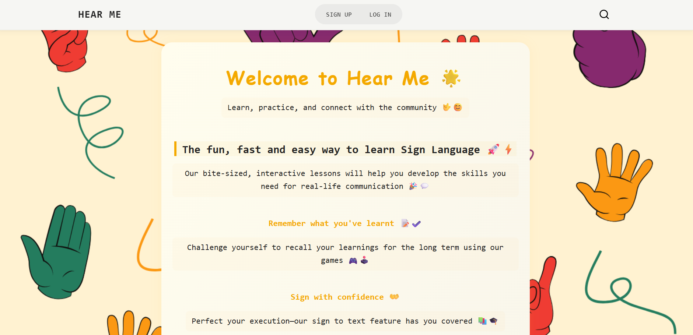

### Landing Page Sign-In


### Calander
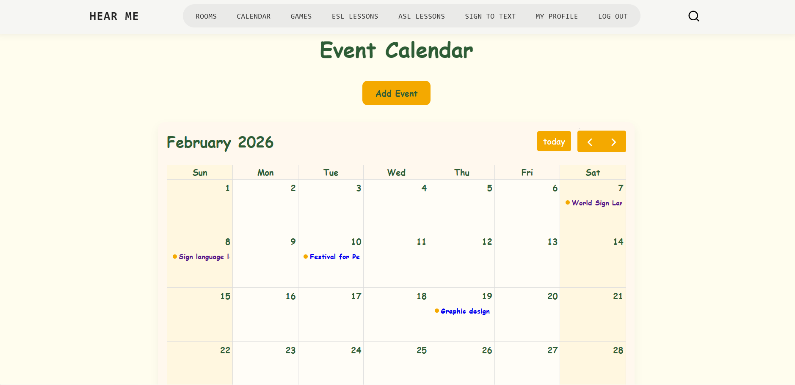

### Event
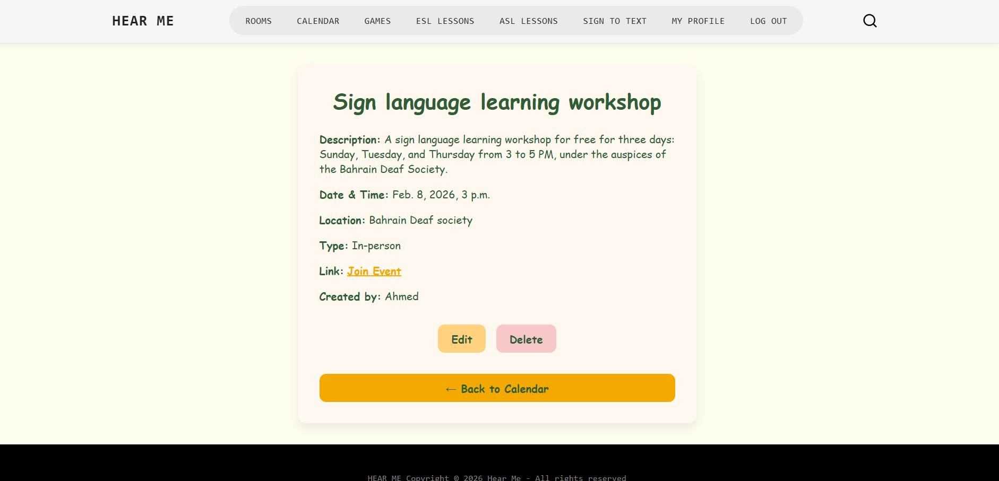

### games
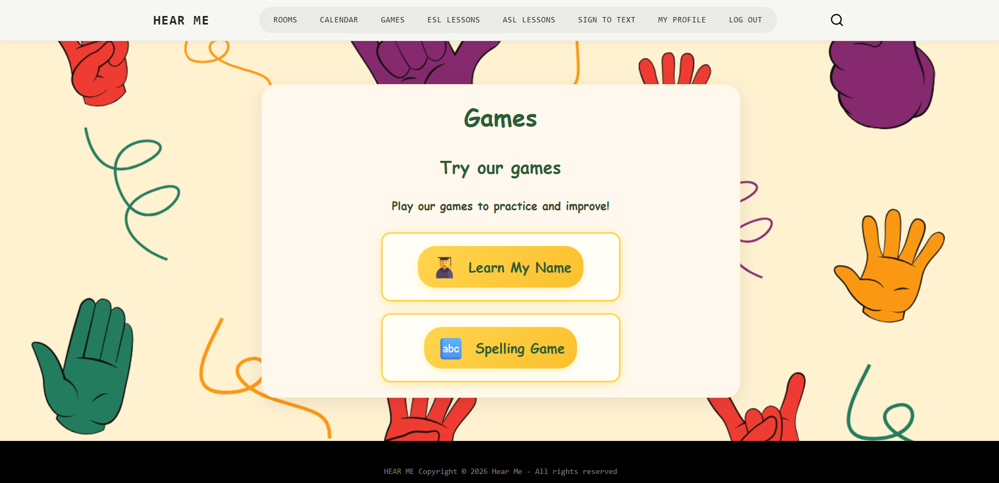

### name game
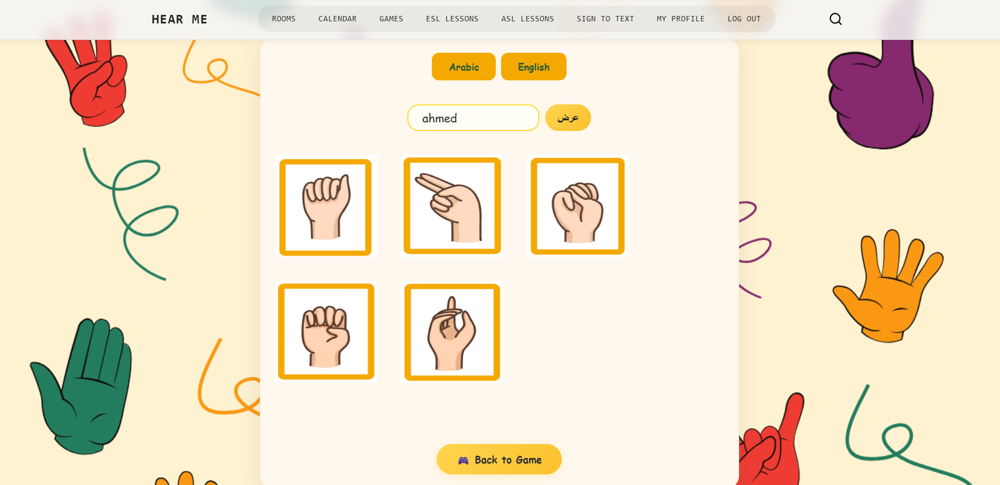

### guess game
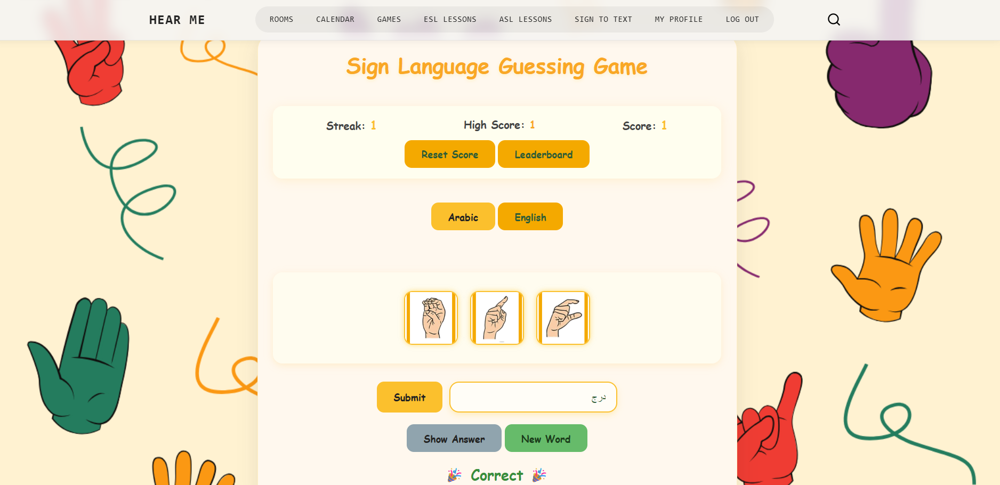

### Live Video Call  
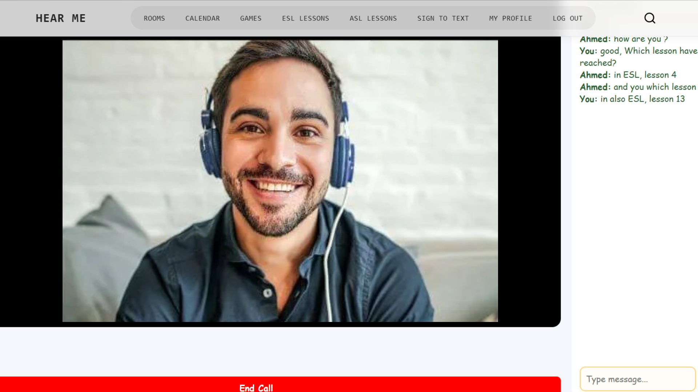

### Sign Language Lessons  
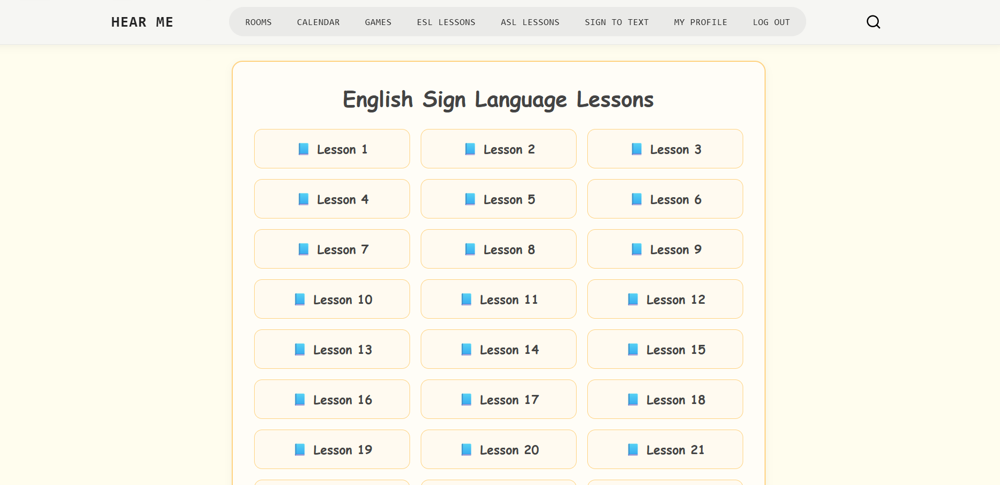

### Sign Language Lessons Details  
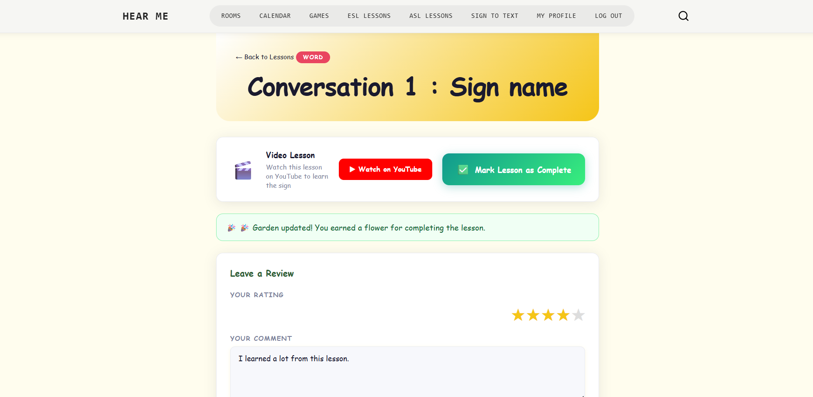

### Recognition  
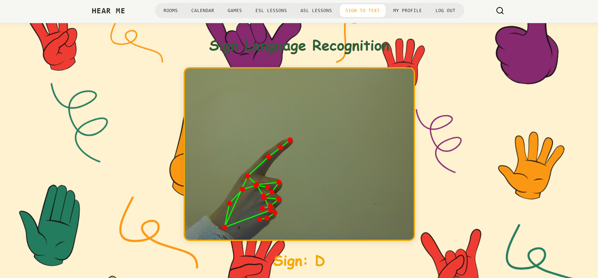

### Profile
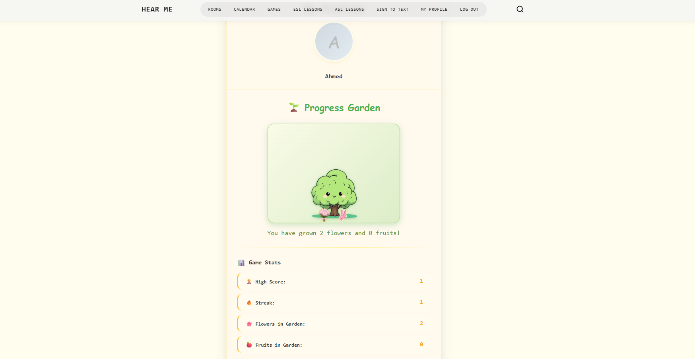

---

## Project Overview

**HearMe** is a full-stack web application designed to bridge communication between deaf and hearing individuals using sign language technology.

The platform focuses on:
- Real-time communication  
- Accessibility and inclusivity  
- AI-powered gesture recognition  
- Interactive learning experience  

---

##  Live Demo


---

### Current Features

- Real-time video calling using WebRTC  
- Live chat inside call rooms  
- User authentication (Sign up / Login / Logout)  
- Sign language learning modules  
- Responsive and accessible UI  
- Room-based communication system  

---

## System Design

### Entities

**Users**
- ID  
- Name  
- Email  
- Password  

**Rooms**
- RoomID  
- Name  
- Max Participants  

**Messages**
- MessageID  
- Content  
- Timestamp  
- UserID (Reference)  
- RoomID (Reference)  

**Lessons**
- LessonID  
- Title  
- Video  
- Language  

---

## Built With

### Backend
- Python (Django)  
- Django Channels (WebSockets)  

### Frontend
- HTML, CSS, JavaScript  

### Database
- PostgreSQL  

### Libraries / Tools
- OpenCV – gesture detection  
- TensorFlow / PyTorch – ML models  
- WebRTC – real-time video/audio  
- gTTS / pyttsx3 – text-to-speech  
- YouTube API – lesson videos  

---

## Getting Started

### 1. Clone the repo
```bash
git clone https://github.com/your-username/hearme.git
cd hearme
