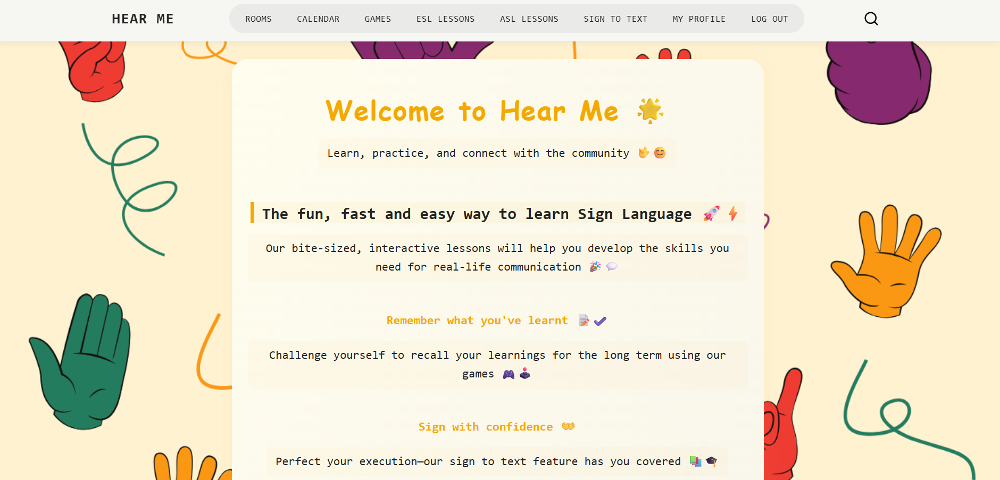

# 🤟 HearMe  
### A Smart Sign Language Communication Platform


---

## UI Preview

### Landing Page  


### Landing Page Sign-In  


### Calendar  


### Event  


### Games  


### Name Game  


### Guess Game  


### Live Video Call  


### Sign Language Lessons  


### Lesson Details  


### Recognition  


### Profile  


---

## Project Overview

**HearMe** is a full-stack web application designed to bridge communication between deaf and hearing individuals using sign language technology.

The platform focuses on:
- Real-time communication  
- Accessibility and inclusivity  
- AI-powered gesture recognition  
- Interactive learning experience  

---

## Features

- **Authentication System**
  - Sign Up, Sign In, and Sign Out

- **Real-Time Communication**
  - Join rooms for video, voice, and chat using WebRTC  
  - Live messaging inside call rooms  

- *Interactive Learning Games**
  - **Guess Game**: Improve spelling by guessing random words and earning points - Languages Available: (Arabic, English) 
  - **Name Game**: Enter any word and get its letters to help with spelling practice - Languages Available: (Arabic, English)

- **Events & Community**
  - View sign language events and festivals in a calendar  
  - Users can add, edit, and delete events  

-  **Sign Language Lessons**
  - Lessons are integrated from YouTube to save time searching - Languages Available: (Arabic, English)
  - Mark lessons as completed to track progress and score  

- **Hand Gesture Recognition**
  - Convert sign language images into text using AI  

- **User Profile & Progress**
  - Track learning level  
  - View points, streaks, and completed lessons  

---

## System Design

### Entities

**Users**
- ID  
- Name  
- Email  
- Password
- streak count
- highscore
- garden level  

**CallRoom**
- room id  
- created_by  
- created at
- is active
- max participants

**GameWord**
- word
- images  
- Language

**Lessons**
- LessonID  
- Lesson Type
- Label
- video_url
- Language

**LessonComment**
- Rating  
- Comment  
- User  
- Lesson

**Event**
- Title  
- Description  
- Date  
- Location
- Is virtual
- Link
- Created by
---

## Built With

### Backend
- Python (Django)  
- Django Channels (WebSockets)  

### Frontend
- HTML, CSS, JavaScript  

### Database
- PostgreSQL  

### Libraries / Tools
- OpenCV – gesture detection  
- TensorFlow / PyTorch – ML models  
- WebRTC – real-time video/audio  
- gTTS / pyttsx3 – text-to-speech  
- YouTube URL – lesson videos  

---

## Getting Started

### 1. Clone the repo
```bash
git clone https://github.com/your-username/Capstone-Project.git
cd hearme
